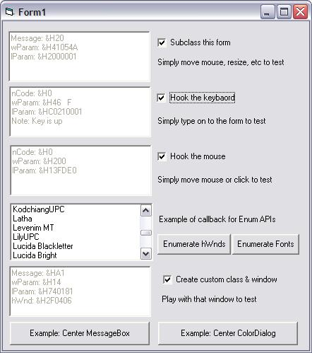



## SelfSub, SelfHook, SelfCallback by Paul Caton

### Description

Hooks END safe now, added Paul's CDECL class to project so we don't lose that one either. Continuing on where Paul Caton left off. Paul has moved on from VB and his thunks are too good to let die. The attached contains a complete revamping of his subclassing thunks and significant enhancements to other thunks. The subclassing thunks, I believe are now 100% IDE-safe. I have even placed END statements inside of the subclass procedure and IDE did not die. The usercontrol (UC) crashes occurring when subclassing parent by multiple UCs is now history too. See the top remarks in cSelfSubHookCallBk_Template for overview. The assembly code is provided in .ASM files and can be opened with notepad. 18Jul07: Minor tweak in subclass.asm to attempt crash on compiled app when END executed. 21Jul07: Believe hook thunks now 100% END safe, added CDECL class allowing one to call C++ APIs or ASM thunks. Workaround for making Hook thunks more END-safe is commented in remarks at top of Template class.
 
### More Info
 

             |
---                |---
**Submitted On**   |2007-07-21 11:26:38
**By**             |[LaVolpe](https://github.com/Planet-Source-Code/PSCIndex/blob/master/ByAuthor/lavolpe.md)
**Level**          |Advanced
**User Rating**    |5.0 (150 globes from 30 users)
**Compatibility**  |VB 5\.0, VB 6\.0
**Category**       |[Miscellaneous](https://github.com/Planet-Source-Code/PSCIndex/blob/master/ByCategory/miscellaneous__1-1.md)
**World**          |[Visual Basic](https://github.com/Planet-Source-Code/PSCIndex/blob/master/ByWorld/visual-basic.md)
**Archive File**   |[SelfSub\_\_S2076517212007\.zip](https://github.com/Planet-Source-Code/lavolpe-selfsub-selfhook-selfcallback-by-paul-caton__1-68737/archive/master.zip)

